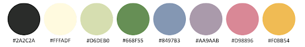
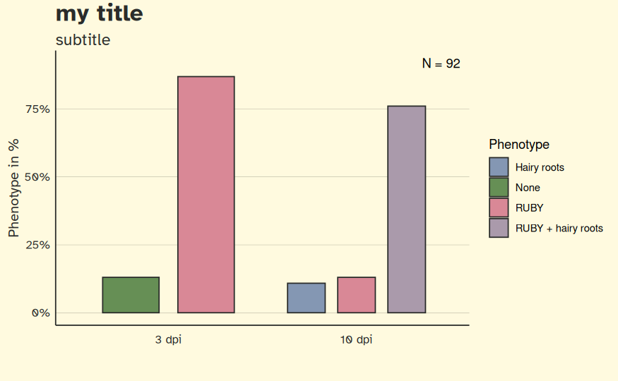

# r-rhizogene

## Installation

Install the package

```
devtools::install_github("yasoomn/r-rhizogene")
```


## Style

Color palette included

Rhizogene light



## Usage

Load the package

```
lbrary(rhizogene)
```
Use the rhizogene theme by default.

```
theme_set(theme_rhizogene())
```

## Creating bar plots for plant data

With these 2 functions it should be possible to create a plot as follows: 



First, pass the CSV data to the `Summarize.plant.data()` function
```
experiment1 = Summarize.plant.data("./myData.csv")
```
This should create a list with the formatted data. Now, lets create a bar plot.

```
Create.plant.bar.plot(experiment1, title "my title", subtitle = "subtitle")
```

leave the "title" or "subtitle" out for a plot without them.

